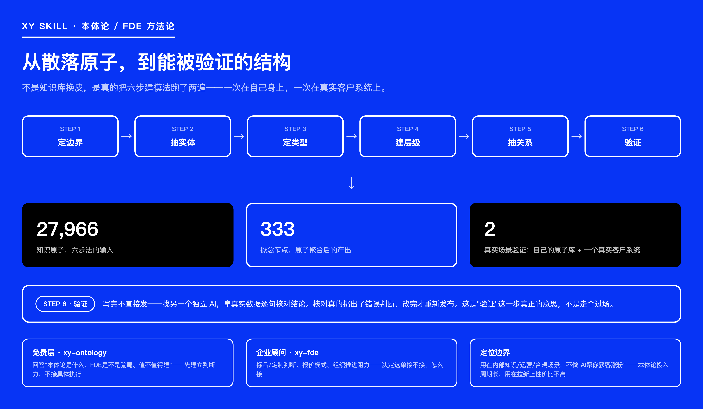

# Fengwu Zhishou · XY Business Operating System

[中文](README.md) | **English**


> *Seen every playbook, kept to first principles.*

**A business & private-domain consultant that lives inside your AI.** Built by a Chinese private-domain operator with over a decade of hands-on experience — scaling a TCM wellness brand to ¥125M in 10 months, an aromatherapy brand to ¥240M in 2 years — this system packages that judgment into **46 Skills** across four lines: **private domain & traffic** (positioning, product selection, content, lead-gen, closing), **business & team** (models, compliance, headcount efficiency), **IP & content creation**, and **Ontology & FDE (Forward Deployed Engineer) methodology**.

The Ontology/FDE line isn't a slide deck: the six-step modeling method actually ran on our own **27,966 knowledge atoms** and one real client system, producing **333 concept nodes** — and an independent AI fact-checked the results line by line before publishing. The process and conclusions are fully public, see [`xy-ontology`](skills/xy-ontology/SKILL.md).


Every judgment traces back to a specific atom ID; when it genuinely can't find one, it says so instead of making one up.

One premise up front: **your private domain can generate its own traffic.** Don't buy into the "grow traffic first, build private domain later" split — your WeChat moments are already an ad slot, your repeat customers already refer new ones, content and lead-gen are capabilities private domain owns on its own.

[Get started](#get-started) · [What it solves](#what-it-solves) · [How Ontology & FDE actually got built](#how-ontology--fde-actually-got-built) · [What's inside](#whats-inside) · [Install](#install)

## Get started

Say this in your Agent once it's installed:

```text
/xy A customer added me on WeChat, chatted a bit, said "too expensive," and went quiet.
Not sure if I should drop the price, change my pitch, or if they were never my target customer.
```

Already know what you want? Name the skill directly (every skill introduces itself in its first line):

```text
/xy-close A customer thinks it's too expensive and stopped replying — is this deal still savable?
/xy-mode I'm designing a three-tier commission structure — check if it crosses any lines.
/xy-selection A supplier friend wants me to sell his enzyme product — is this a good pick?
/xy-vault Turn this folder into my business knowledge base so I can query it directly.
```

Not sure where to start? Say `/xy-coach` — chat with **Xiaoye** (the author's AI persona) for a few minutes like you're talking to a friend, and your business profile gets built (saved locally to `~/.xy/`). Every judgment after that is grounded in your actual numbers.

## What it solves

You don't need to learn a framework or know which tool to call. Hand `/xy` whatever you're stuck on, and it reads where your business actually is; every round closes with three lines: **the one next action, the number to watch, the evidence behind it.**

| Where you're stuck | What you get |
| --- | --- |
| Can't tell if the business is even worth continuing | Seven-point health check, from net profit to growth stage, every call cited |
| Not sure if a product is worth carrying | Two-axis classification, full-cost accounting, three-round paid-test method |
| Customer thinks it's too expensive and goes quiet | Full diagnostic across the whole closing chain, from first chat to repeat purchase |
| Paid ads keep losing money — stop or push through? | Whether to run paid traffic at all, folded into a basic-viability check |
| New account has no traffic, afraid to get banned for lead-gen | Account-warmup and lead-gen path design, tactics ranked by risk |
| Don't know what to post, old customers have gone quiet | Content mix, tagging, concrete reactivation moves |
| Not sure the commission structure is legal | Five-dimension structural review, compliance research paths (no legal verdicts) |
| Can't keep the team, don't know how to set commissions | Efficiency red lines, payout structure, launch-pace review |
| Want a few different perspectives on one decision | Roundtable: 3–5 frameworks argue it out and a verdict gets called |
| Want to pick up last session's conclusion | Local archive: save, resume, case-file backfill — all on your own machine |
| Company's internal rules are a mess, and AI hasn't fixed it | Ontology/FDE: get clear on what it is and whether it's worth building; real rollout follows a gated delivery process |

## How routing and memory connect


One skill at a time. Each round's conclusion becomes the input for the next round's routing — nothing pre-chains into a default sequence:


## How Ontology & FDE actually got built

Ontology is a discipline for defining the entities, types, hierarchy, and relationships inside a business — it traces back to the philosophical study of "being," later borrowed by computer science to solve the problem of "data piling up while AI still can't read the business structure." The role that does this work inside a company is called an FDE (Forward Deployed Engineer, "forward-deployed engineer") — someone who moves into a client's systems with tooling and builds out *that client's own* business structure, rather than selling a generic template.

XY didn't stop at "explaining the concept": the six-step modeling method (define boundaries → extract entities → define types → build hierarchy → extract relations → verify) actually ran twice — once on our own 27,966 knowledge atoms, producing 333 concept nodes; once as a verification pass on one real client system. We didn't publish immediately after finishing — instead, an independent AI fact-checked the conclusions line by line against real data, fixed the errors it found, and only then republished. That's what step six, "verify," is actually for — not a formality.



This line splits into two layers with a hard boundary:

- **`xy-ontology` (free)**: answers "what is Ontology/FDE, how does it differ from a knowledge graph or RAG warehouse, is it worth building for your company" — its job is building judgment, not doing the work.
- **`xy-fde` (enterprise consulting entry point)**: off-the-shelf vs. custom, pricing, internal org resistance — its job is judging whether and how to take on an engagement; actually walking a client's own data through the full modeling process is a separate on-site service.
- **Scope boundary**: this line is for internal knowledge, operations, and compliance scenarios — it is not a "get more customers" growth tool. Ontology work has a long payback cycle and a poor cost/benefit ratio for top-of-funnel acquisition; don't misapply it.

## What's inside

46 skills across 14 areas — plain language routes you in automatically, or call a skill by name:

| Area | Call directly | What you typically get |
| --- | --- | --- |
| Ontology & FDE onboarding | `/xy-ontology` | What Ontology/FDE is, how it differs from a knowledge graph/RAG warehouse, whether it's worth building |
| Enterprise AI consulting | `/xy-fde` | Off-the-shelf vs. custom calls, pricing models, org-adoption resistance |
| Business diagnosis & model | `/xy-biz-scan` `/xy-mode` `/xy-ops` | Seven-point health check, commission review, efficiency & launch-readiness calls |
| Product selection & supply chain | `/xy-selection` | Two-axis classification, cost accounting, paid-test plan |
| IP & positioning | `/xy-ip` `/xy-goal-card` | Seven positioning criteria, an executable goal card |
| Content creation | `/xy-content-scan` `/xy-opener` `/xy-script-glue` `/xy-human-touch` `/xy-replica` | Five-dimension diagnosis, opening-line candidates, flow check, de-AI-flavor pass, viral-content replication |
| Titles & distribution | `/xy-xhs-headline` `/xy-echo-test` | Top-3 titles, resonance-mechanism breakdown |
| Traffic & lead-gen | `/xy-traffic` `/xy-peer-pick` | Account-warmup & lead-gen path, benchmark screening |
| Long-form editing | `/xy-clip` `/xy-recut` | Turn a transcript into short-video segments, or trim/reorder a long video |
| Private-domain ops & closing | `/xy-private-ops` `/xy-close` | Full diagnosis from WeChat moments to repeat purchase |
| Playbooks & precedent | `/xy-playbook` `/xy-precedent` | 8 industry playbook templates, historically-analogous cases |
| Publishing risk | `/xy-publish-guard` `/xy-skill-audit` | Pre-publish risk sweep, local skill security check |
| Frameworks & learning | `/xy-roundtable` `/xy-course` `/xy-term-crack` | Roundtable debate, interactive courses, concept breakdowns |
| Memory & workbench | `/xy-archive` `/xy-resume` `/xy-casefile` `/xy-vault` `/xy-workbench` | Local archives, decision case files, knowledge base, cross-host bridging |

Full skill list with Chinese names, trigger conditions, and sample inputs: [XY 指令清单](docs/XY指令清单.md) (Chinese only).

## Install

**Easiest:**

```bash
npx -y skills add xyaz1313/xyskill -g --all
```

Then say `/xy 新手入门` in your Agent to get going.

**Or clone and run the install script:**

```bash
git clone https://github.com/xyaz1313/xyskill.git && cd xyskill
bash install.sh
```

| Your tool | Skills directory |
|---|---|
| Claude Code | `~/.claude/skills/` |
| Codex | `~/.agents/skills/` |
| Kimi Code | `~/.kimi-code/skills/` |
| Cursor / WorkBuddy / others | `~/.cursor/skills/` · `~/.workbuddy/skills/` · `~/.agents/skills/` |

**Or through the Claude Code plugin marketplace:**

```bash
claude plugin marketplace add https://github.com/xyaz1313/xyskill.git
claude plugin install xy@xy-skills
```

Use the full `https://` URL, not the `owner/repo` shorthand — the shorthand falls back to SSH and fails on machines without an SSH key configured for GitHub.


**Update:** already installed? Say `/xy-sync` to your Agent, or run `bash skills/xy-sync/scripts/xy-sync.sh sync`. Updates never touch your personal profile, archives, or decision records in `~/.xy/`.

Chinese is the system's native tongue, but it follows the language you use — ask in English, get English back.

## License

This repo is licensed under [CC BY-NC 4.0](https://creativecommons.org/licenses/by-nc/4.0/) (see `LICENSE`):

- Free for personal use, learning, research, and non-commercial projects.
- If you publish a derivative work, please credit the source.
- Commercial use requires separate licensing — contact the author below.

## Author & support

Author: **Xiaoye** · Business creator · Private-domain operator · Ontology/FDE methodology practitioner · [Douyin](https://v.douyin.com/njWgCcCFUYY/)


Scan to connect on WeChat — for questions, commercial licensing or enterprise consulting.

---

<sub>This project's early routing and skill-skeleton design drew on some ideas from the open-source project [dbskill](https://github.com/dontbesilent2025/dbskill) (by dontbesilent, CC BY-NC 4.0), noted here for the record — no text, tweets, or knowledge data from it were used; all content and knowledge atoms are original to this project. Respect to Don't Be Silent 🙏</sub>
