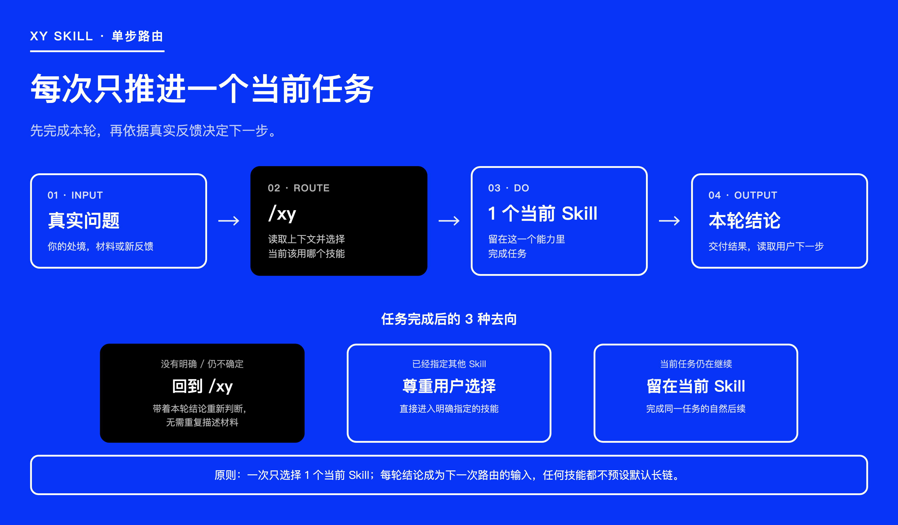
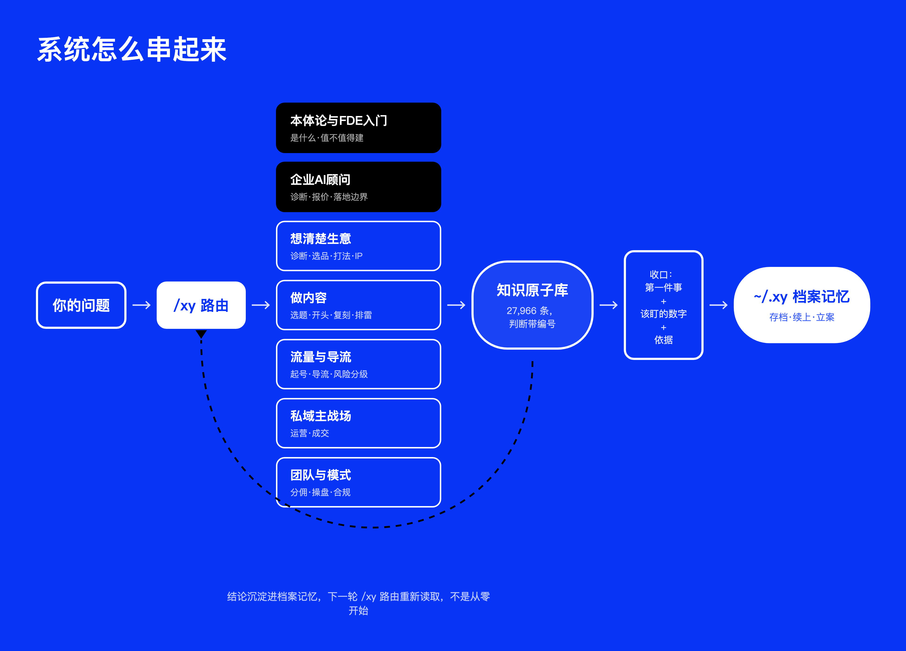

# 风物执守 · XY 操盘系统


> 面向老板与创业者的商业中文 AI Skills 工具箱。从定位、选品、内容、流量、私域、成交，到商业模式与团队管理——把生意里任何一段的真实问题交给 Agent，获得有依据的判断和马上能做的下一步。


**支持：Claude Code、Codex、豆包、WorkBuddy，以及其他支持 Skills 的 Agent。**

小爷做私域二十年，从 0 带过好几个盘子到过亿。风物执守把这些年真正管用的判断，拆成 **27,853 条能查、能引用的知识原子**和 **45 个能直接调的 Skill**。

[上手三步](#上手三步) · [能解决什么](#能解决什么) · [装好之后有什么](#装好之后有什么) · [怎么装](#怎么装) · [指令清单](docs/XY指令清单.md)

## 上手三步

装完后在 Agent 里直接说事：

```text
/xy 客户加我微信之后，聊几句就说"太贵了"，然后就不回消息了。
我不知道是该降价、换话术，还是这些客户本来就不是我的目标客户。
```

已经知道要什么，直接点名（每个 Skill 第一行都会自报家门，告诉你它是谁、管什么）：

```text
/xy-close 客户嫌贵不回消息，这单还有救吗？
/xy-mode 我想设计一个三级分销，帮我看看踩不踩线。
/xy-selection 有个供应链朋友让我做他的酵素，这个品能做吗？
/xy-vault 把我这堆客户聊天记录和货盘表变成知识库，以后直接从里面查。
```

不知道从哪问起，先说 `/xy-coach`——跟**小爷**（作者的 AI 分身）像朋友一样聊几分钟，聊完你的生意档案就建好了（存你自己电脑 `~/.xy/`），往后每次判断都基于你的真实盘子，不用重讲。

## 能解决什么

不用先学一套方法，也不用记该调哪个工具。把当下卡住的事交给 `/xy`，它认你生意到了哪一步、该往哪走；每轮收口三句话：**接下来第一件事、该盯的数字、依据是哪条**。

| 你现在卡在哪 | 会拿到什么 |
| --- | --- |
| 生意还要不要做下去，算不清赚不赚钱 | 七项体检：从净利润到成长阶段，判断带原子编号 |
| 这个品能不能碰 | 两轴分类、全成本核算、收费测试三轮法 |
| 客户嫌贵、聊着聊着不回了 | 从首聊到复购的整条成交链逐环诊断 |
| 新号没流量、导流怕封号 | 起号与导流路径设计、手法风险分级 |
| 朋友圈不知道怎么发、老客沉睡 | 内容配比、标签分层、激活沉睡的具体动作 |
| 这个分佣制度合不合规、是不是传销 | 模式定性五维审查、合规查证路径 |
| 团队留不住人、提成不知道怎么设 | 人效红线、分钱结构、起盘节奏审查 |
| 想找几位不同角度的人一起参谋 | 圆桌会议：3–5 套框架同台交锋并裁定分歧 |
| 上次的结论想接着用 | 本地档案：存档、续上、立案回填，全在你自己电脑 |

## 路由和记忆怎么接起来



一次只进一个 Skill，这一轮的结论会变成下一轮判断的依据，不会替你预设一条长链路：



## 装好之后有什么

45 个 Skill 覆盖 13 个方向，说人话就能自动进对门，也能直接用命令点名：

| 方向 | 直接点名 | 通常给你什么 |
| --- | --- | --- |
| 商业诊断与模式 | `/xy-biz-scan` `/xy-mode` `/xy-ops` | 七项体检、分佣审查、人效与起盘判断 |
| 企业AI落地顾问 | `/xy-fde` | 标品/定制判断、报价模式、组织推进阻力应对 |
| 选品与供应链 | `/xy-selection` | 两轴分类、成本核算、收费测试方案 |
| IP 与定位 | `/xy-ip` `/xy-goal-card` | 七项定位标准、可开工的目标卡 |
| 内容创作 | `/xy-content-scan` `/xy-opener` `/xy-script-glue` `/xy-human-touch` | 五维诊断、开头候选、衔接检查、去 AI 味 |
| 标题与传播 | `/xy-xhs-headline` `/xy-echo-test` | 标题 Top 3、共鸣机制解码 |
| 流量与导流 | `/xy-traffic` `/xy-peer-pick` | 起号与导流路径、对标筛选 |
| 长内容剪辑 | `/xy-clip` `/xy-recut` | 逐字稿切成短视频组装方案、长视频删减重排 |
| 私域运营与成交 | `/xy-private-ops` `/xy-close` | 朋友圈到复购的逐环诊断 |
| 赛道与先例 | `/xy-playbook` `/xy-precedent` | 8 张赛道模板、历史同构案例 |
| 发布与风险 | `/xy-publish-guard` `/xy-skill-audit` | 发布排雷、本地 Skill 安检 |
| 思辨与学习 | `/xy-roundtable` `/xy-course` `/xy-term-crack` | 圆桌交锋、交互式课程、概念拆解 |
| 档案与工作台 | `/xy-archive` `/xy-resume` `/xy-casefile` `/xy-vault` `/xy-workbench` | 本地存档、决策立案、知识库、多端桥接 |

完整 45 个 Skill 的中文名、适用时机与输入示例，见 [XY 指令清单](docs/XY指令清单.md)。

## 怎么装

**最省事：**

```bash
npx -y skills add xyaz1313/xyskill -g --all
```

装完回到 Agent，说一句 `/xy 新手入门`就能开始。

**想自己跑安装脚本：**

```bash
git clone https://github.com/xyaz1313/xyskill.git
cd xyskill && bash install.sh   # 桥接全部 skill 到已装宿主 + 装教练 + 初始化 ~/.xy
```

**走 Claude Code 插件市场：**

```bash
claude plugin marketplace add https://github.com/xyaz1313/xyskill.git
claude plugin install xy@xy-skills
```

用完整 `https://` 地址，别用 `owner/repo` 简写——简写在没配 SSH key 的机器上会走 SSH 失败，`https://` 地址一定能用。


宿主兼容见 `docs/宿主兼容矩阵.md`。

**更新：** 已经装过的机器，对着 Agent 说一句 `/xy-sync` 就能同步到最新版；也能自己在终端跑 `bash skills/xy-sync/scripts/xy-sync.sh sync`。更新不动你 `~/.xy/` 里的个人档案、存档和决策记录；进 `/xy` 时如果远端有更新，它会顺带提醒一句，不会打断你。

## 原子库从哪来

`knowledge/atoms.jsonl` 里 27,853 条知识原子，按 13 个方向、94 个细分块打了标签，条条能独立成立、能互相回链。来源分四块：小爷自己的实战（课程体系、真实账号和直播复盘、二十年创业史，带真实数字的都标 `high` 置信）；商业管理谈判这类方法论（全部重写成生意场景的话再入库）；抖音小红书微信视频号四大平台的现行规则；第三方付费训练营的方法论内容（讲者与学员姓名已脱敏，具体案例段落排除在外，只保留可复用的判断和做法）。检索排序上，自有实战永远排前面。

## 目录长什么样

| 位置 | 放的是什么 |
| --- | --- |
| `skills/` | 45 个 Skill 的真源 |
| `agents/xy-coach.md` | 教练智能体 |
| `_shared/` | 9 条信条、语气红线、路由契约、板块清单 |
| `knowledge/` | 原子库（`_internal/` 是内部草料，不对外分发） |
| `scripts/` | atoms-search.py 检索脚本、xy-init、xy-brain |
| `docs/` | 新手入门、指令清单、宿主兼容矩阵 |
| `hooks/` | 会话启动钩子 |

## 想改点什么

- 改某个 Skill：只动 `skills/<name>/SKILL.md`；`references/atoms.jsonl` 是这个 Skill 被单独拷出仓库外时的本地兜底子集，跟着一起改。
- 往库里加原子：直接追加进 `knowledge/atoms.jsonl`（字段照现有的来：id/type/knowledge/original/confidence/topics/skills/source_type/source_label），记得同步进对应 Skill 的 `references/atoms.jsonl`。
- 出新版本：改 `UPDATE.json` 里的 `version` 和 `notice`，打个 git tag。

## 免责声明

这套系统给出的是基于知识库的经营判断和自查路径，**不是法律、税务、医疗或投资意见**。涉及模式合规、税务安排、广告宣传、用工合同这类事，以执业律师、税务师的意见为准；涉及产品功效，以监管部门认可的检测和批文为准。用这套系统做出的经营决策，责任在使用者自己。

## 作者与支持

作者：**小爷** · 商业博主 · 私域操盘手 · [抖音](https://v.douyin.com/njWgCcCFUYY/)


扫码加微信——问题反馈、商业授权、企业咨询都找这里。

## 授权

本仓库用 [CC BY-NC 4.0](https://creativecommons.org/licenses/by-nc/4.0/) 授权（见 `LICENSE`）：

- 个人使用、学习、研究与非商业项目可以直接使用。
- 公开发布衍生作品时，请注明来源。
- 商业用途需要单独授权，请联系作者（联系方式见上）。

---

<sub>本项目早期在路由与技能骨架的设计上，参考过开源项目 [dbskill](https://github.com/dontbesilent2025/dbskill)（作者 dontbesilent，CC BY-NC 4.0）的部分思路，如实说明；没有用它的文本、推文和知识数据，正文和知识原子都是本项目自建的。致敬 Don't Be Silent —— Respect 🙏</sub>
